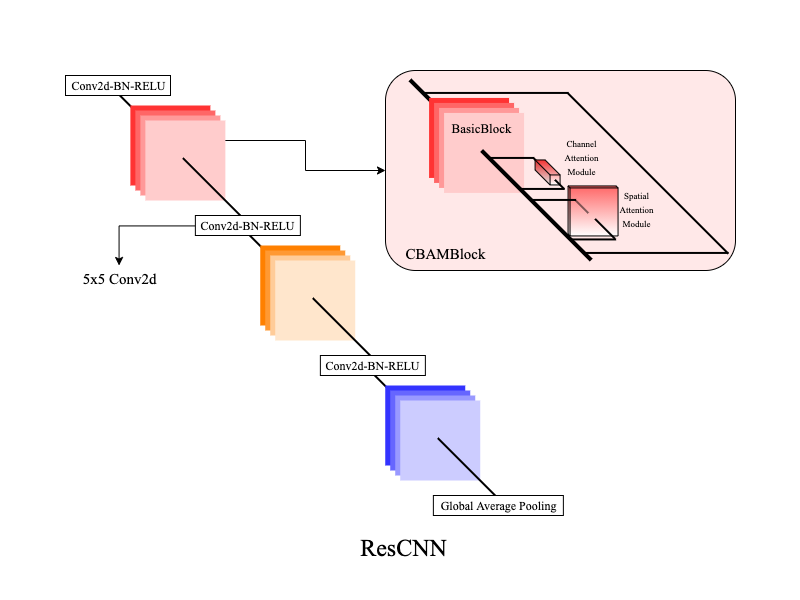
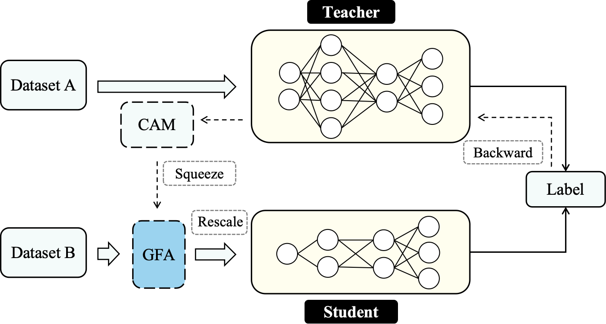
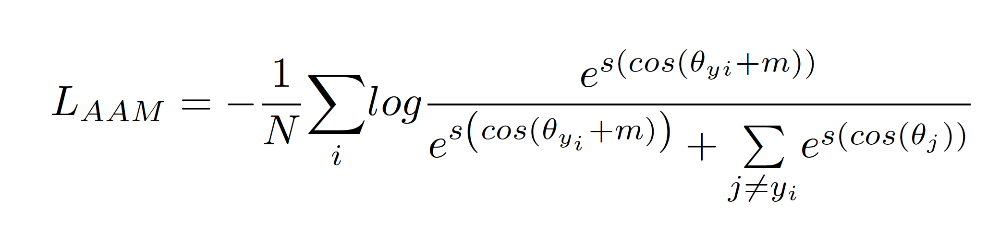
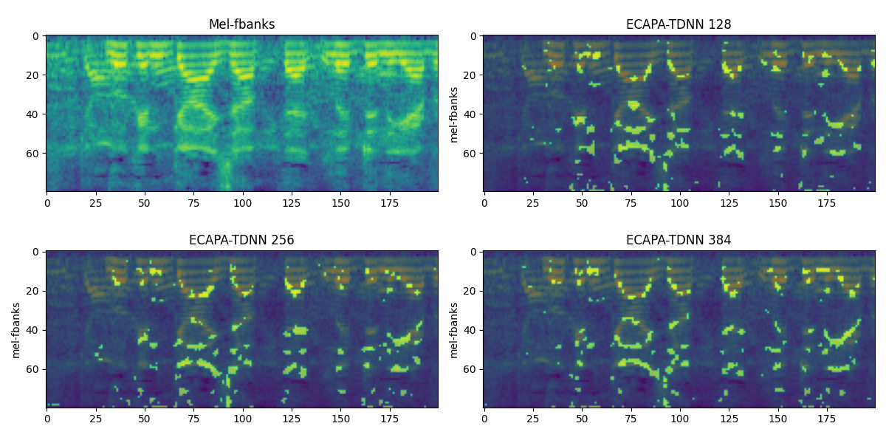
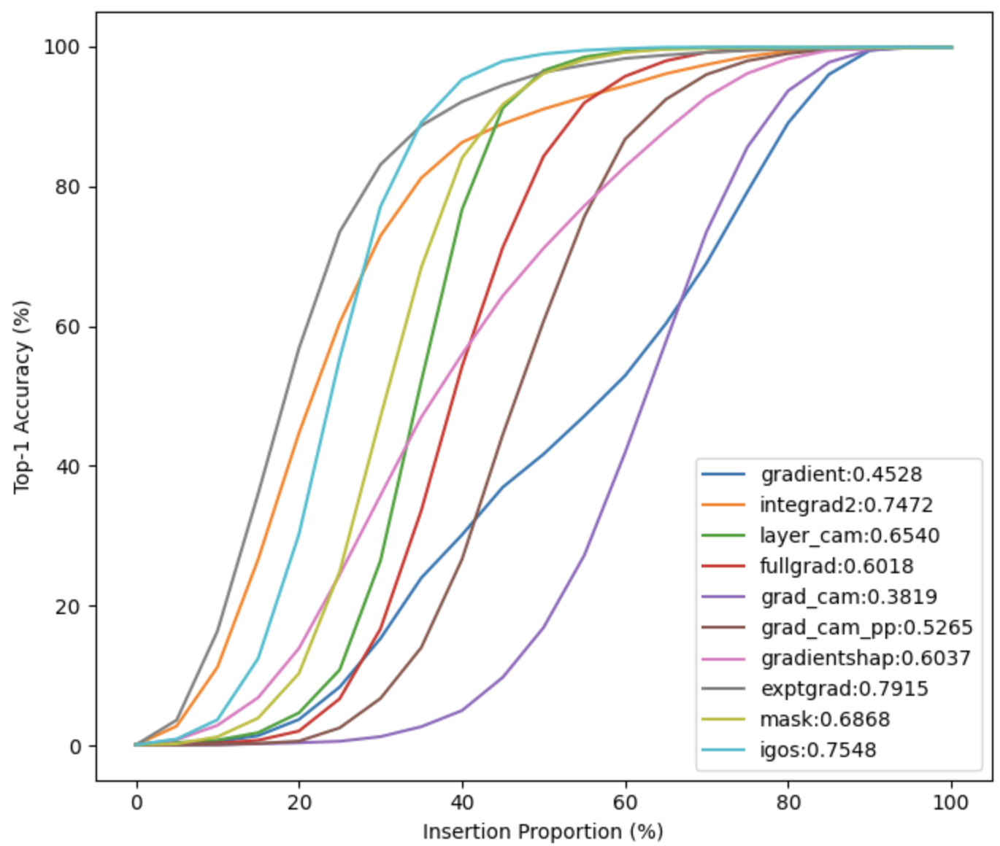
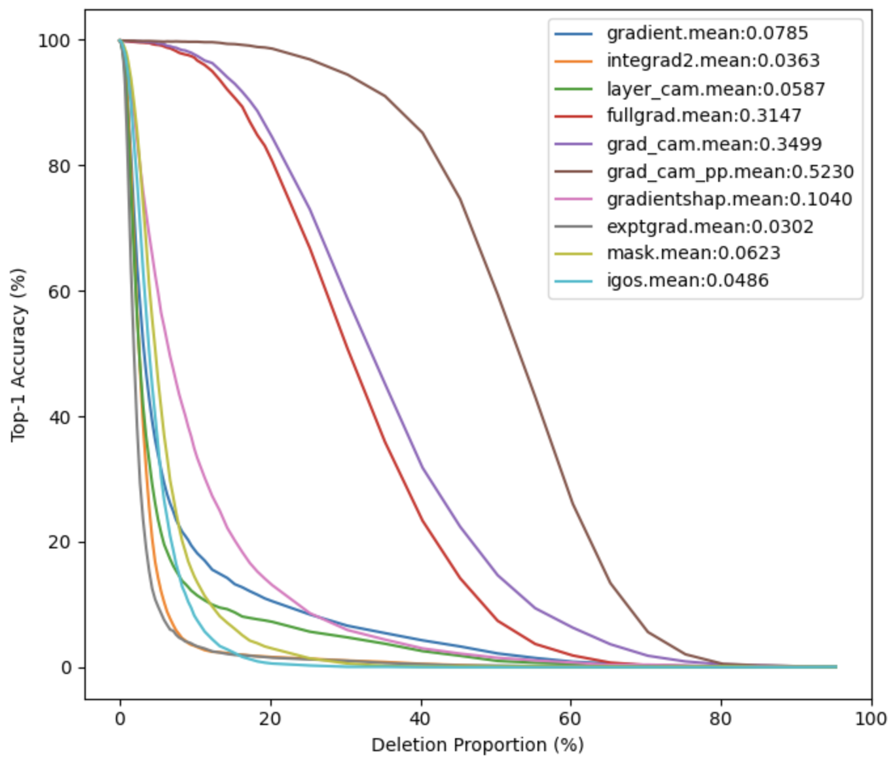

# Gradient Frequency Attention

This is the official code for '**Gradient Frequency Attention: Tell Neural Networks where speaker information is.**'

**Gradient Frequency Attention Mechanism** utilizes the weight from trained speaker recognition neural networks to tell a new neural networks where speaker information is. The weight is based on gradient computation, related to Class Activation Mapping (CAM).

By appling the attention mechanism to Convolutional Neural Networks, we prove it to be valid for build a low-cost Speaker Verification (SV) model from a widder or deeper neural network model. 


## 1.Datasets

We select VoxCeleb1 and VoxCeleb2 as the datasets. In VoxCeleb1, there are 1,211 speakers with 148,642 utterances
for training and 40 speakers with 4,870 utterances for testing. Only the VoxCeleb2 development set is used as a training set. There are 5,994 speakers with 1,092,009 utterances.

#### Data Preparation

All the acoustic features are prepared in kaldi way. And then we generate kaldi-like egs for training. Here we asume that the kaldi has been installed. The data augmentation is the same as the example `voxceleb/v2` in kaldi. The clean utterances are augmented by MUSAN and RIR datasets. But we keep all the augmented utterances for sampling.

```shell
    # Making 161 dimensional spectrograms for dev and test set.
    # VoxCeleb1
    for name in dev test; do
        steps/make_spect.sh --write-utt2num-frames true --spect-config conf/spect_161.conf \
          --nj 12 --cmd "$train_cmd" \
          data/vox1/klsp/${name} data/vox1/klsp/${name}/log data/vox1/klsp/spect/${name}
        utils/fix_data_dir.sh data/vox1/klsp/${name}
    done
    # VoxCeleb2
    for name in dev ; do
        steps/make_spect.sh --write-utt2num-frames true --spect-config conf/spect_161.conf \
          --nj 12 --cmd "$train_cmd" \
          data/vox2/klsp/${name} data/vox2/klsp/${name}/log data/vox2/klsp/spect/${name}
        utils/fix_data_dir.sh data/vox2/klsp/${name}
    done
    # Split part of train set for verification test.
    for name in vox1 vox2;do
      python datasets/make_trials.py 20000 data/${name}/klsp/dev                # generate 2w verification pairs for the dev set
      mv data/${name}/klsp/dev/trials trials_2w                                 # rename the trials
      python datasets/split_trials_dir.py --data-dir data/${name}/klsp/dev \
        --out-dir data/${name}/klsp/dev/trials_dir \
        --trials trials_2w
    done
    
    # Making egs for 161 dimensional spectrograms
    ./a_prep_egs.sh 

```


## 2.Deep Speaker Neural Networks

#### 2.1.Neural Networks

##### ResNet-based Networks

[ResCNN](models/ResNets.py) is a CNN with Channel Block Attention Blocks for verification as Figure.1. In our testing, this model proved to outperform many SV systems on VoxCeleb1
when we input spectrograms into it. Dropout is applied before  the average pooling layer.

<!--  -->

##### TDNN-based Networks


[TDNN](models/TDNNs.py) is the neural network meantioned in *x-vectors*.

[ECAPA-TDNN](models/ECAPA-TDNNs.py) is the neural network meantioned in *ECAPA-TDNN*.

#### 2.2.Gradient Frequency Attention




#### 2.3.Loss Function

Additive Angular Margin (Arcsoft) Softmax loss function is adpoted in our experiments, where the margin is 0.2 and scale is 30.

<div align="center">  </div>
<!--  -->


#### 2.4.Score

For all the SV systems, embeddings are extracted from the last hidden layer. Cosine similarities are computed for comparsion of pairs of speaker embeddings.


### 4.Training

Set the stage variable in the `train.sh` script and start training by:

```shell
    ./c_train.sh
```
By default, during the training stage, the script will valid for each epoch and test once for 4 epoch.

To extract the weights from trained models, the following commands will be needed:

```shell
    ./b_extract.sh 
    # step1: python gradients/cam_extract.py         ------> extract gradients from enough utteranes in training set
    # ...
    # step2: python gradients/visual_gradient.py     ------> compute and save the mean gradients along with the frequency axis
```
The extracted weights should be stored in .


### 5.Results

#### 5.1.Gradient

We extracted Saliency Mappings using **InteGrated Gradients** (IG) method for input Mel Fbanks. We plot the maximum gradients (5%) for ECAPA-TDNN with different Width (Channels) .


<div align="center">  </div>


#### 5.2.Saliency Mappings Comparison
We carried insertion and deletion experiments to compare the performance of Saliency Mapping Methods. We plot the insertion and deletion results as the following figure.

<div align="center">


</div>

Integrated Gradient (IG) and Expected IG is the most effective method in speaker verification for Saliency Mapping.

#### 5.3. Performance

##### Input Attention Refinement

Equal Error Rate and Minimum Detection Cost Function are reported here.

> **clean**: the training set is clean Voxceleb1 dev set. **aug**: the training set is the augmented VoxCeleb1 dev set. **mel**: the initial weight is linearly distributed and equal in the Mel scale. **vox2**: the training set is clean VoxCeleb2 dev set.

<table>
<thead>
  <tr>
    <th rowspan="2">Model</th>
    <th rowspan="2">Data <br>Augment</th>
    <th rowspan="2">Attention<br>Layer</th>
    <th rowspan="2">EER<br>(%)</th>
    <th colspan="2">Min-DCF</th>
  </tr>
  <tr>
    <th>p=0.01</th>
    <th>p=0.001</th>
  </tr>
</thead>
<tbody>
  <tr>
    <td colspan="6" rowspan="2">Trainset: VoxCeleb1 dev </td>
  </tr>
  <tr>
  </tr>
  <tr>
    <td rowspan="2">ResCNN-64</td>
    <td>-</td>
    <td>-</td>
    <td>3.27</td>
    <td>0.3078</td>
    <td>0.4189</td>
  </tr>
  <tr>
    <td>+</td>
    <td>-</td>
    <td>2.84</td>
    <td>0.2735</td>
    <td>0.4051</td>
  </tr>
  <tr>
    <td rowspan="5">ResCNN-32<br><br><br></td>
    <td>-</td>
    <td>-</td>
    <td>3.66</td>
    <td>0.3411</td>
    <td>0.4408</td>
  </tr>
  <tr>
    <td>-</td>
    <td>mel</td>
    <td>3.43</td>
    <td>0.3169</td>
    <td>0.3806</td>
  </tr>
  <tr>
    <td>-</td>
    <td>clean</td>
    <td>3.27</td>
    <td>0.3187</td>
    <td>0.3876</td>
  </tr>
  <tr>
    <td>-</td>
    <td>aug</td>
    <td>3.27</td>
    <td>0.3201</td>
    <td>0.3913</td>
  </tr>
  <tr>
    <td>-</td>
    <td>vox2</td>
    <td>3.26</td>
    <td>0.3032</td>
    <td>0.4597</td>
  </tr>
  <tr>
    <td rowspan="5">ResCNN-16</td>
    <td>-</td>
    <td>-</td>
    <td>4.21</td>
    <td>0.3781</td>
    <td>0.5214</td>
  </tr>
  <tr>
    <td>-</td>
    <td>mel</td>
    <td>4.23</td>
    <td>0.3831</td>
    <td>0.5475</td>
  </tr>
  <tr>
    <td>-</td>
    <td>clean</td>
    <td>4.11</td>
    <td>0.3652</td>
    <td>0.5319</td>
  </tr>
  <tr>
    <td>-</td>
    <td>aug</td>
    <td>4.27</td>
    <td>0.3505</td>
    <td>0.4622</td>
  </tr>
  <tr>
    <td>-</td>
    <td>vox2</td>
    <td>4.09</td>
    <td>0.3792</td>
    <td>0.4627</td>
  </tr>
  <tr>
    <td>TDNN</td>
    <td>-</td>
    <td>-</td>
    <td>4.77</td>
    <td>0.4639</td>
    <td>0.6023</td>
  </tr>
  <tr>
    <td rowspan="5">TDNN-s</td>
    <td>-</td>
    <td>-</td>
    <td>4.54</td>
    <td>0.4565</td>
    <td>0.6230</td>
  </tr>
  <tr>
    <td>-</td>
    <td>mel</td>
    <td>4.61</td>
    <td>0.4556</td>
    <td>0.5933</td>
  </tr>
  <tr>
    <td>-</td>
    <td>clean</td>
    <td>4.52</td>
    <td>0.4539</td>
    <td>0.6195</td>
  </tr>
  <tr>
    <td>-</td>
    <td>aug</td>
    <td>4.56</td>
    <td>0.4764</td>
    <td>0.5762</td>
  </tr>
  <tr>
    <td>-</td>
    <td>vox2</td>
    <td>4.42</td>
    <td>0.4986</td>
    <td>0.6446</td>
  </tr>
  <tr>
    <td colspan="6" rowspan="2">Trainset: VoxCeleb2 dev     </td>
  </tr>
  <tr>
  </tr>
  <tr>
    <td>ResCNN-64</td>
    <td>-</td>
    <td>-</td>
    <td>1.73</td>
    <td>0.1562</td>
    <td>0.2391</td>
  </tr>
</tbody>
</table>

### 6.Reference

- [Kaldi](https://github.com/kaldi-asr/kaldi)


